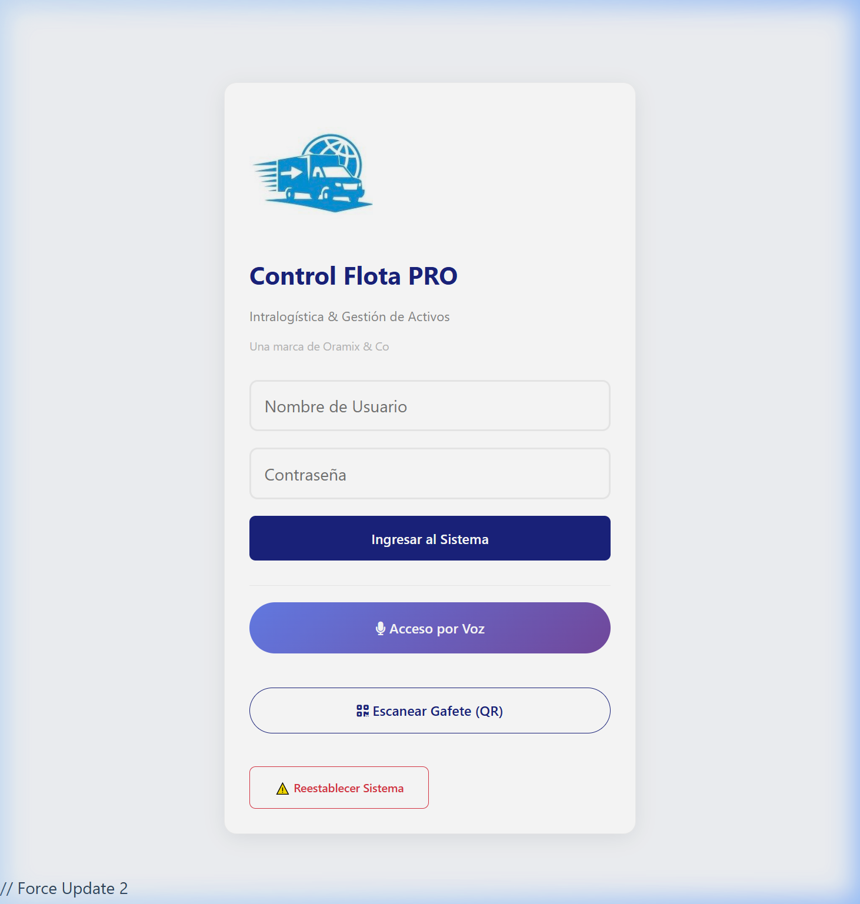
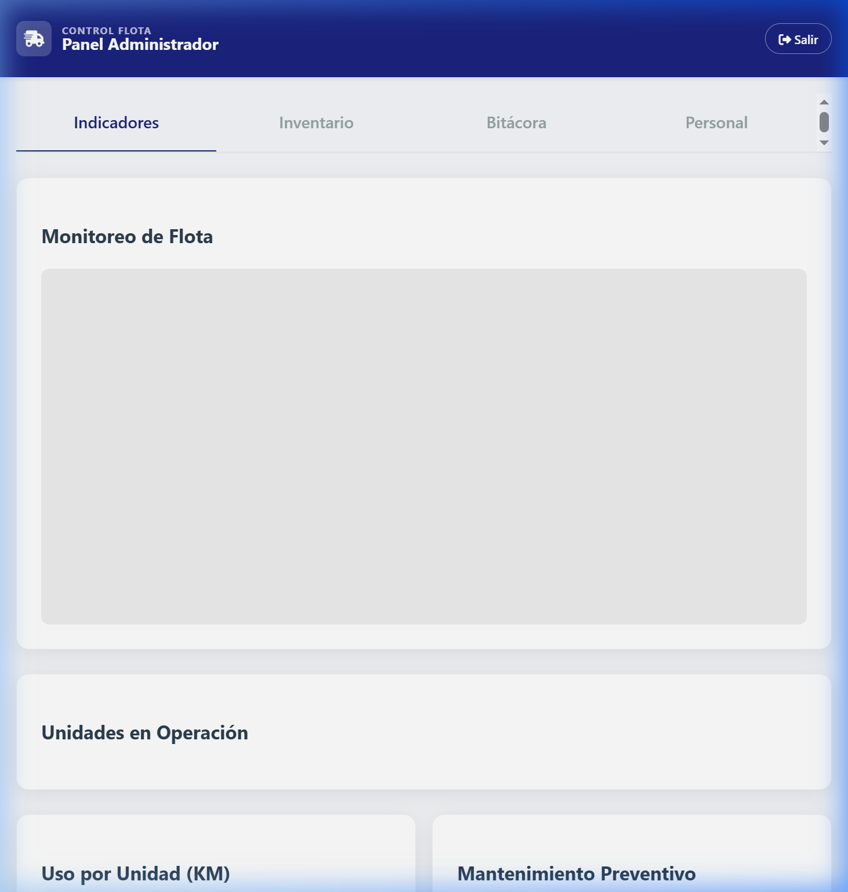
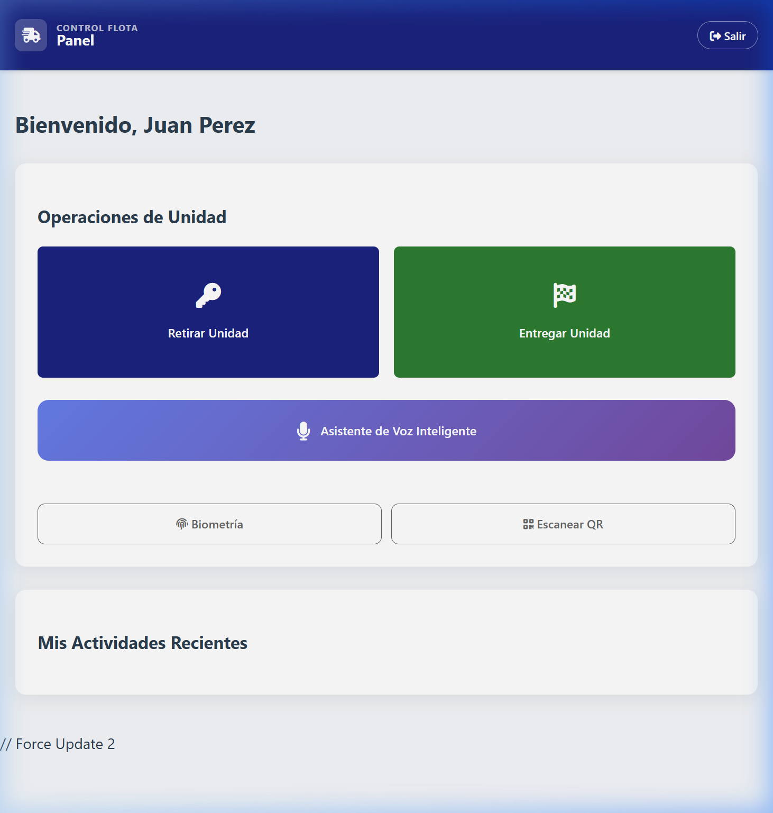

# Control Flota PRO
> **Professional Fleet Management System** | Optimized for Logistics and Field Operations.

[](https://opensource.org/licenses/MIT)
[](https://developer.mozilla.org/en-US/docs/Web/Progressive_web_apps)
[]()

**Control Flota PRO** is a comprehensive, client-side fleet management application designed to bridge the gap between drivers and administrators. It features real-time tracking, biometric authentication, voice-controlled operations, and predictive maintenance alerts.

---

## Características Principales (Español)

- **Panel de Control Proactivo**: Visualización de flota en tiempo real mediante mapas integrados (Leaflet).
- **Asistente de Voz Inteligente**: Permite el registro de salidas y entradas mediante comandos de voz naturales.
- **Autenticación Biométrica**: Acceso seguro mediante huella dactilar o reconocimiento facial (WebAuthn).
- **Escaneo QR Moderno**: Identificación rápida de unidades y gafetes de personal mediante QR.
- **Mantenimiento Preventivo**: Sistema de alertas automáticas basadas en kilometraje y vigencia de documentos (Seguro/Verificación).
- **Reportes Dinámicos**: Gráficas de rendimiento (Chart.js) y exportación de bitácoras en formato CSV.
- **Modo Offline**: Capacidad de funcionamiento sin conexión mediante almacenamiento local persistente.

---

## Key Features (English)

- **Proactive Admin Dashboard**: Real-time fleet visualization using integrated maps (Leaflet).
- **Smart Voice Assistant**: Complete checkout and check-in processes using natural voice commands.
- **Biometric Authentication**: Secure access via fingerprint or facial recognition (WebAuthn).
- **Modern QR Scanning**: Fast identification of vehicles and staff badges via QR technology.
- **Predictive Maintenance**: Automatic alert system based on mileage and document validity (Insurance/Inspection).
- **Dynamic Analytics**: Performance visualizations (Chart.js) and master log export to CSV.
- **Offline Capabilities**: Full functionality without internet connection via persistent local storage.

---

## Technology Stack

- **Frontend**: Vanilla JavaScript (ES6+), Modern HTML5, Custom CSS3 Variables.
- **Data Visualization**: [Chart.js](https://www.chartjs.org/)
- **Mapping**: [Leaflet.js](https://leafletjs.com/)
- **QR Support**: [Html5-QRCode](https://github.com/mebjas/html5-qrcode)
- **Voice Engine**: Web Speech API (Native)
- **Security**: WebAuthn API for Biometrics.

---

## Getting Started / Guía de Inicio

1. **Clone the repository**:
   ```bash
   git clone https://github.com/your-username/control-flota-pro.git
   ```
2. **Open the project**:
   Simply open `index.html` in any modern browser (Chrome, Edge, or Safari).
   *Note: Biometric features and GPS require a secure context (HTTPS/Localhost).*

3. **Try the Demo Data**:
   Navigate to the **Dashboard** and use the **"Simular Historial"** tool to populate the app with 30 days of professional activity data.

---

## Screenshots

| Login & Security | Admin Dashboard | Driver Operations |
| :--- | :--- | :--- |
|  |  |  |

---

## License
This project is open-source and available under the **MIT License**.

---
*Developed for high-performance logistic teams.*
